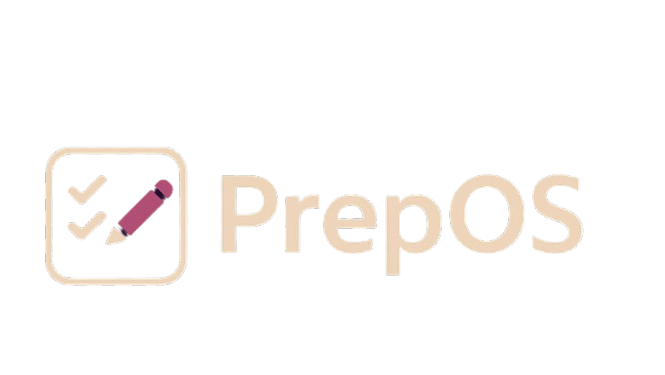
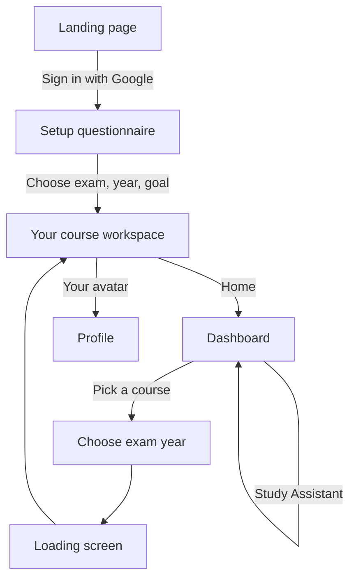

<p align="center">
  
</p>

<h1 align="center">Prep OS</h1>

<p align="center">
  <strong>A student-built platform for competitive exam preparation — calendars, timers, resources, and study help in one place.</strong>
</p>

<p align="center">
  <span style="display:inline-block; background:#2B124C; color:#FBE4D8; padding:0.35em 0.85em; border-radius:999px; font-size:0.85em; font-weight:600; margin:0.2em;">Static web app</span>
  <span style="display:inline-block; background:#522B5B; color:#FBE4D8; padding:0.35em 0.85em; border-radius:999px; font-size:0.85em; font-weight:600; margin:0.2em;">Sign in with Google</span>
  <span style="display:inline-block; background:#2B124C; color:#DFB6B2; padding:0.35em 0.85em; border-radius:999px; font-size:0.85em; font-weight:600; margin:0.2em;">Prototype</span>
</p>

<p align="center">
  
</p>

---

## Table of contents

- [What is Prep OS?](#what-is-prep-os)
- [Features](#features)
- [Supported exams](#supported-exams)
- [Quick start (run locally)](#quick-start-run-locally)
- [How to use the app](#how-to-use-the-app)
- [Pages at a glance](#pages-at-a-glance)
- [Disclaimer](#disclaimer)

---

## What is Prep OS?

**Prep OS** is built by students, for students preparing for exams like NEET, JEE, SAT, and more. Instead of hunting across the internet for calendars, timers, and resources, Prep OS brings those tools together in one consistent workspace.

You run it locally in your browser — no app store install required for this prototype.

---

## Features

| Area | What you get |
|------|----------------|
| **Welcome & setup** | Landing page, Google sign-in, short questionnaire (exam, year, target score) |
| **Course workspace** | A dedicated page per exam with the same toolkit layout |
| **Study calendar** | Month view — add and view study events |
| **Pomodoro timer** | Focus timer plus a separate rest timer |
| **Resources** | Exam-specific materials (SAT has the richest resource and mock-test section) |
| **To-do list** | Track tasks while you study |
| **Study Assistant** | Chat-style helper for study tips and exam guidance on the dashboard and course pages |
| **Profile** | Your account summary — open it from your avatar on a course page |

---

## Supported exams

| Exam | Where to go (after starting the server) |
|------|----------------------------------------|
| **SAT** | `http://localhost:8000/sat.html` — also see English/Math companions below |
| **JEE** | `http://localhost:8000/jee.html` |
| **NEET** | `http://localhost:8000/neet.html` |
| **CUET** | `http://localhost:8000/cuet.html` |
| **ESAT** | `http://localhost:8000/esat.html` |
| **LSAT** | `http://localhost:8000/lsat.html` |

**SAT companions** (linked from SAT resources or open directly):

- `http://localhost:8000/satenglish.html`
- `http://localhost:8000/satmath.html`

---

## Quick start (run locally)

Do **not** open the HTML files by double-clicking them. Use a simple local server so sign-in and pages load correctly.

### 1. What you need

- **Python 3** (usually pre-installed on Mac; on Windows, install from [python.org](https://www.python.org/downloads/) if needed)
- A modern browser (Chrome, Edge, Firefox, or Safari)
- An internet connection (for Google sign-in and fonts)

### 2. Start the server

Open **Terminal** (Mac) or **Command Prompt / PowerShell** (Windows), go to this project folder, and run:

```bash
python3 -m http.server 8000
```

On Windows, if that fails, try:

```bash
python -m http.server 8000
```

When it works, you’ll see a message like: `Serving HTTP on port 8000`.

### 3. Open Prep OS

In your browser, visit:

### **http://localhost:8000/landing.html**

That’s the main entry point.

| Page | URL |
|------|-----|
| Welcome & sign-in | http://localhost:8000/landing.html |
| Dashboard (pick a course) | http://localhost:8000/prototype.html |
| Profile | http://localhost:8000/profile.html |

### 4. When you’re done

In the terminal, press **Ctrl + C** to stop the server.

**Tip:** If Google sign-in doesn’t open, allow pop-ups for `localhost` in your browser settings.

---

## How to use the app

### Flow overview



### Path 1 — Start from the landing page (recommended)

1. Open **http://localhost:8000/landing.html**
2. Click **Continue with Google** and sign in.
3. Answer the **three setup questions** (exam, year, target score).
4. You’ll land on your course page (for example, SAT → `sat.html`).
5. Use the **left sidebar**:
   - Calendar  
   - Pomodoro Timer  
   - Resources  
   - To-Do List  
   - AI Study Assistant  
6. Tap your **name or avatar** at the top for **Profile**, or **Home** to return to the dashboard.

### Path 2 — Browse courses from the dashboard

1. Open **http://localhost:8000/prototype.html**
2. Click a course (SAT, CUET, NEET, JEE, ESAT, or LSAT).
3. Choose your **exam year**, wait on the short loading screen, then explore your workspace.

You can sign in from the dashboard anytime via **Login with Google** in the header.

### Study Assistant (dashboard)

On `prototype.html`, the **Study Assistant** panel at the bottom can be expanded to ask about study habits, exam subjects, time management, and more.

---

## Pages at a glance

| File | What it’s for |
|------|----------------|
| `landing.html` | Welcome, features overview, Google sign-in |
| `loginqq.html` | Setup questionnaire after sign-in |
| `prototype.html` | Main dashboard — course picker and Study Assistant |
| `year.html` | Pick the year you plan to take the exam |
| `loading.html` | Brief transition before your course opens |
| `sat.html`, `jee.html`, `neet.html`, etc. | Full study workspace for each exam |
| `satenglish.html`, `satmath.html` | SAT section companions |
| `profile.html` | Your profile |

Brand assets in the folder: **PREP-OS-TITLE-LOGO.png**, **PREP-OS_LOGO-removebg-preview.png**, and **brinjal.png** (mascot on the landing page and course sidebar).

---

## Disclaimer

Prep OS is a **prototype** for demonstration. Exam names (SAT, JEE, NEET, CUET, ESAT, LSAT, etc.) belong to their respective organizations. Prep OS is not affiliated with those exam boards.

---

<p align="center">
  <sub>Built by students, for students — <strong>Prep OS</strong></sub>
</p>
