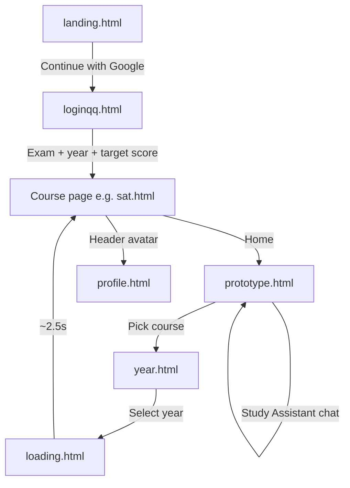
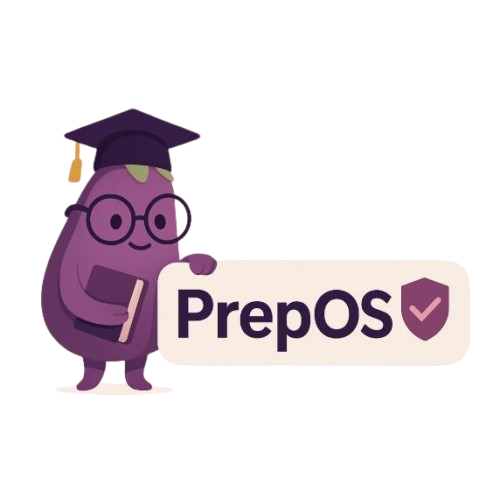

<p align="center">
  
</p>

<h1 align="center">Prep OS</h1>

<p align="center">
  <strong>A student-built prototype for competitive exam preparation — one place for calendars, timers, resources, and study help.</strong>
</p>

<p align="center">
  
  
  
  
</p>

<p align="center">
  
</p>

---

## Table of contents

- [What is Prep OS?](#what-is-prep-os)
- [Features](#features)
- [Supported exams](#supported-exams)
- [Quick start (run locally)](#quick-start-run-locally)
- [How to use the app](#how-to-use-the-app)
- [Project structure](#project-structure)
- [Design system](#design-system)
- [Firebase & authentication](#firebase--authentication)
- [Additional docs](#additional-docs)
- [Deploying to GitHub Pages (optional)](#deploying-to-github-pages-optional)
- [License & disclaimer](#license--disclaimer)

---

## What is Prep OS?

**Prep OS** (Prep Operating System) is a finished front-end prototype aimed at students preparing for major competitive exams in India and abroad. Instead of juggling scattered tabs and paid funnels, the idea is to combine study planning, productivity tools, curated resources, and a study assistant in a single, cohesive experience.

This repository is **static HTML, CSS, and JavaScript** — no build step, no Node.js required for local development. Firebase powers Google sign-in and optional user preference storage in Firestore.

---

## Features

| Area | What you get |
|------|----------------|
| **Landing & onboarding** | Branded welcome page, Google sign-in, onboarding questionnaire (exam, year, target score) |
| **Course hub** | Dedicated workspace pages for each exam with a shared layout |
| **Study calendar** | Month view with event creation |
| **Pomodoro timer** | Focus + rest timers for structured sessions |
| **Resources** | Exam-specific links and materials (SAT includes expandable mock-test UI) |
| **To-do list** | Task tracking inside each course page |
| **Study Assistant** | Rule-based chat helper on the dashboard and course pages (prototype responses, not a live LLM API) |
| **Profile** | View account details; navigate from the course header when signed in |

---

## Supported exams

| Exam | Course page | Notes |
|------|-------------|--------|
| **SAT** | `sat.html` | Richest resource section; companion pages `satenglish.html`, `satmath.html` |
| **JEE** | `jee.html` | Full toolkit layout |
| **NEET** | `neet.html` | Full toolkit layout |
| **CUET** | `cuet.html` | Full toolkit layout |
| **ESAT** | `esat.html` | Full toolkit layout |
| **LSAT** | `lsat.html` | Full toolkit layout |

---

## Quick start (run locally)

Opening HTML files directly from the filesystem (`file://`) can break Firebase auth and some assets. **Always serve the folder over HTTP.**

### 1. Prerequisites

- **Python 3** (macOS and most Linux installs include it; [python.org](https://www.python.org/downloads/) on Windows)
- A modern browser (Chrome, Edge, Firefox, Safari)
- Internet access (Firebase SDK and Google Fonts load from CDNs)

### 2. Start a local server

Open a terminal, `cd` into this project folder, then run:

```bash
python3 -m http.server 8000
```

On Windows, if `python3` is not found:

```bash
python -m http.server 8000
```

You should see something like: `Serving HTTP on :: port 8000 ...`

### 3. Open the app

In your browser, go to:

**[http://localhost:8000/landing.html](http://localhost:8000/landing.html)**

That is the intended entry point for the full sign-in flow.

| URL | Purpose |
|-----|---------|
| [http://localhost:8000/landing.html](http://localhost:8000/landing.html) | Main entry — sign in with Google |
| [http://localhost:8000/prototype.html](http://localhost:8000/prototype.html) | Dashboard — pick a course or use the floating Study Assistant |
| [http://localhost:8000/loginqq.html](http://localhost:8000/loginqq.html) | Onboarding questionnaire (requires sign-in) |
| [http://localhost:8000/profile.html](http://localhost:8000/profile.html) | User profile (requires sign-in) |

### 4. Stop the server

In the terminal where the server is running, press **`Ctrl + C`**.

---

## How to use the app

### Flow overview



### Recommended path (authenticated)

1. Start the server and open **`landing.html`**.
2. Click **Continue with Google** and complete Google sign-in.
3. Complete the **3-step questionnaire** on `loginqq.html` (exam, year, target score). Preferences are saved to `localStorage` and Firestore when available.
4. You are redirected to the matching course page (e.g. `sat.html`).
5. Use the **left sidebar**: Calendar, Pomodoro, Resources, To-Do, AI Study Assistant.
6. Click your **avatar/name** in the header to open **Profile**, or **Home** to return to the dashboard.

### Browse without landing (dashboard-first)

1. Open **`prototype.html`** directly.
2. Choose a course card (SAT, CUET, NEET, JEE, ESAT, LSAT).
3. Pick an exam year on **`year.html`** → brief **`loading.html`** screen → course page.

You can still use **Login with Google** from the dashboard header; signed-in users see avatar and logout controls.

### SAT mock-test companions

From the SAT resources section, or navigate directly after starting the server:

- [http://localhost:8000/satenglish.html](http://localhost:8000/satenglish.html)
- [http://localhost:8000/satmath.html](http://localhost:8000/satmath.html)

---

## Project structure

```
.
├── README.md                 ← You are here
├── FIREBASE_SETUP.md         ← Firebase project setup guide
├── ICON_SETUP.md             ← Study Assistant icon notes (dashboard chat)
├── firebase-config.js        ← Reference template (placeholders)
│
├── landing.html              ← App entry (sign-in)
├── loginqq.html              ← Onboarding questionnaire
├── prototype.html            ← Main dashboard + Study Assistant widget
├── loading.html              ← Transition loader between year pick and course
├── year.html                 ← Exam year selection
├── profile.html              ← User profile
│
├── sat.html                  ← SAT workspace (most complete)
├── satenglish.html           ← SAT English companion
├── satmath.html              ← SAT Math companion
├── jee.html / neet.html / cuet.html / esat.html / lsat.html
│
├── course.html               ← Placeholder (minimal)
│
├── PREP-OS-TITLE-LOGO.png    ← Wordmark / title logo
├── PREP-OS_LOGO-removebg-preview.png  ← Icon used in Study Assistant header
└── brinjal.png               ← Brand mascot / sidebar & landing art
```

---

## Design system

Prep OS uses a consistent dark purple palette across pages:

| Token | Hex | Usage |
|-------|-----|--------|
| Background | `#190019` | Page background |
| Card | `#2B124C` | Panels, sidebar, headers |
| Accent | `#522B5B` | Buttons, highlights |
| Muted | `#DFB6B2` | Secondary text, stats |
| Cream | `#FBE4D8` | Primary readable text |

Typography on key screens uses **[Manrope](https://fonts.google.com/specimen/Manrope)** via Google Fonts.

<p align="center">
  
</p>

---

## Firebase & authentication

The prototype uses **Firebase Authentication (Google)** and **Cloud Firestore** for user records and onboarding preferences.

- **Authorized domains:** For local testing, add `localhost` in Firebase Console → Authentication → Settings → Authorized domains.
- **Pop-up blockers:** Google sign-in uses a popup; allow popups for `localhost` if sign-in fails silently.
- **Own Firebase project:** If you fork this repo, follow [`FIREBASE_SETUP.md`](FIREBASE_SETUP.md) and update the `firebaseConfig` blocks embedded in the HTML files (and optionally align `firebase-config.js` as documentation).

> **Note:** Firebase web API keys are designed to be included in client apps; security is enforced with Firebase rules and domain restrictions. Use Firestore security rules before any public production deployment.

---

## Additional docs

- [`FIREBASE_SETUP.md`](FIREBASE_SETUP.md) — Create a Firebase project, enable Google sign-in and Firestore, update config.
- [`ICON_SETUP.md`](ICON_SETUP.md) — Customize the Study Assistant icon on `prototype.html`.

---

## Deploying to GitHub Pages (optional)

Because this is a static site, you can host it on GitHub Pages:

1. Push this repository to GitHub.
2. In the repo: **Settings → Pages → Build and deployment → Source**: deploy from branch **`main`**, folder **`/` (root)**.
3. Add your `*.github.io` domain (and custom domain if any) to Firebase **Authorized domains**.
4. Open `https://<username>.github.io/<repo>/landing.html` as the public entry URL.

---

## License & disclaimer

This project is a **prototype** for demonstration and learning. Exam names (SAT, JEE, NEET, etc.) belong to their respective owners. Prep OS is not affiliated with those exam boards unless explicitly stated elsewhere.

---

<p align="center">
  <sub>Built by students, for students — <strong>Prep OS</strong></sub>
</p>
